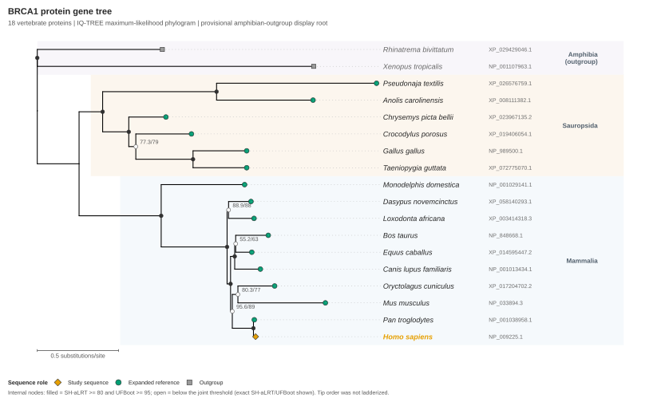

# Gene-to-Reference Tree

[](https://github.com/Hongda-Zhao/bio-gene-to-reference-tree/actions/workflows/validate.yml)
[](LICENSE)

**Build the reference set before you build the tree.**

[What it does](#what-it-does) · [Install](#install) · [Progressive Skill](#progressive-skill) · [Nucleotide quick start](#nucleotide-quick-start) · [BRCA1 example](#brca1-example) · [Quick links](#quick-links)

## What it does

An open, portable Agent Skill for building an auditable **protein or nucleotide gene tree** from an accession, declared local sequence, or gene/protein/feature name plus organism.

It resolves the query, finds and reviews homolog or ortholog candidates, selects references and outgroups, plans molecule-specific MAFFT/trimAl and FastTree/IQ-TREE2 commands through available host tools, and produces iTOL or local ggtree/ggplot2 outputs. It avoids the unsafe shortcut of treating the top similarity hits as a ready-made reference set.

> **Execution model:** deterministic `plan`/`route` modes do not run workflow tools. `doctor` defaults to passive `PATH` discovery; live retrieval, active version probes, and bioinformatics execution require separately approved host or local capabilities.

| Stage | Main result |
|---|---|
| Query | Versioned record or hash-bound, explicitly declared local molecule with provenance |
| References | Selected and rejected candidates, reason codes, taxonomic balance, and outgroup rationale |
| Alignment | Raw MSA, conservation assessment, QC, and trimming sensitivity |
| Tree | Unrooted gene tree, optional approved rooted copy, model, and explicitly documented support method |
| Reporting | Sequence metadata, iTOL roles, optional SVG/PDF, and current-literature comparison |

The Skill reports a gene tree, not automatically a species tree; similarity is not treated as proof of orthology.

## Install

Browse the rendered Skill on [skills.sh](https://skills.sh/hongda-zhao/bio-gene-to-reference-tree/bio-gene-to-reference-tree), or install it with the third-party `skills` CLI:

```bash
npx skills add Hongda-Zhao/bio-gene-to-reference-tree \
  --skill bio-gene-to-reference-tree
```

For an explicit global client installation, add `--agent codex`, `--agent cursor`, or `--agent claude-code` together with `--global`.

| Client | Invoke after installation |
|---|---|
| Codex | `$bio-gene-to-reference-tree ...` |
| Cursor | `/bio-gene-to-reference-tree ...` |
| Claude Code | `/bio-gene-to-reference-tree ...` |

See [detailed installation](docs/installation.md) for global commands, manual directories, Cursor discovery, Claude Marketplace installation, and telemetry settings.

Minimal example:

```text
$bio-gene-to-reference-tree Build an auditable ortholog protein tree for human BRCA1 NP_009225.1, retain the unrooted result, and evaluate amphibian outgroups.
```

## Progressive Skill

The installable package follows the open [Agent Skills specification](https://agentskills.io/specification) and uses progressive disclosure:

| Level | Loaded content |
|---:|---|
| 0 | `SKILL.md` name and description for discovery |
| 1 | The compact [Skill router](skills/bio-gene-to-reference-tree/SKILL.md) and [workflow gates](skills/bio-gene-to-reference-tree/references/workflow.md) |
| 2 | Only the current task file from `references/steps/` |
| 3 | Shared policy, contract, evidence, guide, asset, or script only when triggered |

The ten task modules are directly addressable:

| Step | Task |
|---:|---|
| 1 | [Resolve the query](skills/bio-gene-to-reference-tree/references/steps/01-resolve-query.md) |
| 2 | [Define the objective](skills/bio-gene-to-reference-tree/references/steps/02-define-objective.md) |
| 3 | [Discover candidates](skills/bio-gene-to-reference-tree/references/steps/03-discover-candidates.md) |
| 4 | [Select references and outgroups](skills/bio-gene-to-reference-tree/references/steps/04-select-references-and-outgroups.md) |
| 5 | [Cluster expanded candidates](skills/bio-gene-to-reference-tree/references/steps/05-cluster-expanded-candidates.md) |
| 6 | [Align and assess conservation](skills/bio-gene-to-reference-tree/references/steps/06-align-and-assess-conservation.md) |
| 7 | [Trim and test sensitivity](skills/bio-gene-to-reference-tree/references/steps/07-trim-and-test-sensitivity.md) |
| 8 | [Infer, root, and check the tree](skills/bio-gene-to-reference-tree/references/steps/08-infer-root-and-check-tree.md) |
| 9 | [Annotate and visualize](skills/bio-gene-to-reference-tree/references/steps/09-annotate-and-visualize.md) |
| 10 | [Compare evidence and report](skills/bio-gene-to-reference-tree/references/steps/10-compare-evidence-and-report.md) |

The router loads one step at a time and retains review gates before reference approval, alignment choice, and tree inference.

## Nucleotide quick start

Request schema 0.3 supports comparable noncoding DNA/RNA regions and clean coding DNA/RNA. It never guesses molecule type from sequence letters: noncoding nucleotide uses MAFFT `--nuc` plus a DNA tree model, while eligible clean CDS uses verified translations, protein-guided MAFFT, and trimAl `-backtrans`. A clean CDS request then explicitly chooses either an IQ-TREE codon model or a nucleotide-site DNA model on the codon-preserving alignment. Frameshifted or disrupted CDS stops for reviewed MACSE handling rather than being treated as ordinary nucleotide.

```text
$bio-gene-to-reference-tree Build an auditable noncoding-dna gene tree from my resolved local FASTA, use only comparable homologous loci and an actual nucleotide search database, retain the unrooted tree, and report MAFFT --nuc plus IQ-TREE -st DNA commands.
```

See the [minimal request 0.3 JSON](skills/bio-gene-to-reference-tree/assets/request.nucleotide.example.json) and [sequence-type router](skills/bio-gene-to-reference-tree/references/sequence-type-routing.md) for RNA source-encoding provenance, CDS QC, exact commands, and hard stops.

## BRCA1 example



The executed example starts from human RefSeq BRCA1 [`NP_009225.1`](https://www.ncbi.nlm.nih.gov/protein/NP_009225.1) and reviews a fixed 18-protein vertebrate set. It validates taxonomy and terminal RING/BRCT architecture, compares three trim profiles, and infers the primary tree with IQ-TREE2 ModelFinder plus 1,000 UFBoot2 and 1,000 SH-aLRT replicates.

| Result | Executed value |
|---|---|
| Sampling | 16 amniote ingroup proteins + 2 amphibian outgroups |
| Taxonomy/QC | 18/18 exact scientific-name/TaxID matches; 162/162 terminal-domain checks passed |
| Alignment | MAFFT E-INS-i; 2,179 raw columns; balanced trim retained 1,851 (84.95%) |
| Primary tree | IQ-TREE 2.4.0; `Q.bird+F+I+R3`; 1,000 SH-aLRT + 1,000 UFBoot2 |
| Rooting | Amphibian-rooted copy retained as a provisional display hypothesis |

Orange marks the focal human sequence, green marks added references, and gray marks outgroups. This remains a protein gene tree; the complete audit preserves commands, versions, hashes, warnings, non-promoted attempts, and execution reconciliation outside the homepage.

[full executed audit record](examples/brca1/README.md) ·
[detailed audit SVG](examples/brca1/figures/gene-tree.outgroup-rooted.ggtree.svg) ·
[detailed audit PDF](examples/brca1/figures/gene-tree.outgroup-rooted.ggtree.pdf) ·
[unrooted Newick](examples/brca1/tree/gene-tree.unrooted.nwk) ·
[rooted derivative](examples/brca1/tree/gene-tree.outgroup-rooted.nwk) ·
[metadata](examples/brca1/annotation/sequence_metadata.tsv) ·
[execution reconciliation](examples/brca1/report/execution_reconciliation.json) ·
[50-candidate expanded review](examples/brca1-expanded/README.md)

## Quick links

| Need | Go to |
|---|---|
| Install on Codex, Cursor, or Claude Code | [Installation guide](docs/installation.md) |
| Read the agent entrypoint | [Canonical `SKILL.md`](skills/bio-gene-to-reference-tree/SKILL.md) |
| Follow states and approval gates | [Workflow](skills/bio-gene-to-reference-tree/references/workflow.md) |
| Choose protein, noncoding nucleotide, or clean CDS analysis | [Sequence-type router](skills/bio-gene-to-reference-tree/references/sequence-type-routing.md) |
| Match tasks to local, browser, or HPC capabilities | [Environment and software routing](skills/bio-gene-to-reference-tree/references/environment-routing.md) |
| Inspect artifacts and schemas | [Output contract](skills/bio-gene-to-reference-tree/references/output-contract.md) |
| Resolve exact NCBI scientific names/TaxIDs | [Taxonomy policy](skills/bio-gene-to-reference-tree/references/taxonomy-resolution.md) |
| Review recent MSA/trimming evidence | [Evidence guide](skills/bio-gene-to-reference-tree/references/recent-msa-trimming-evidence.md) |
| Render a local tree figure | [ggtree/ggplot2 guide](skills/bio-gene-to-reference-tree/references/ggtree-visualization.md) |
| Review privacy boundaries | [Privacy policy](PRIVACY.md) |
| Reuse or inspect the worked example | [BRCA1 audit](examples/brca1/README.md) |

MIT licensed. See [LICENSE](LICENSE).
