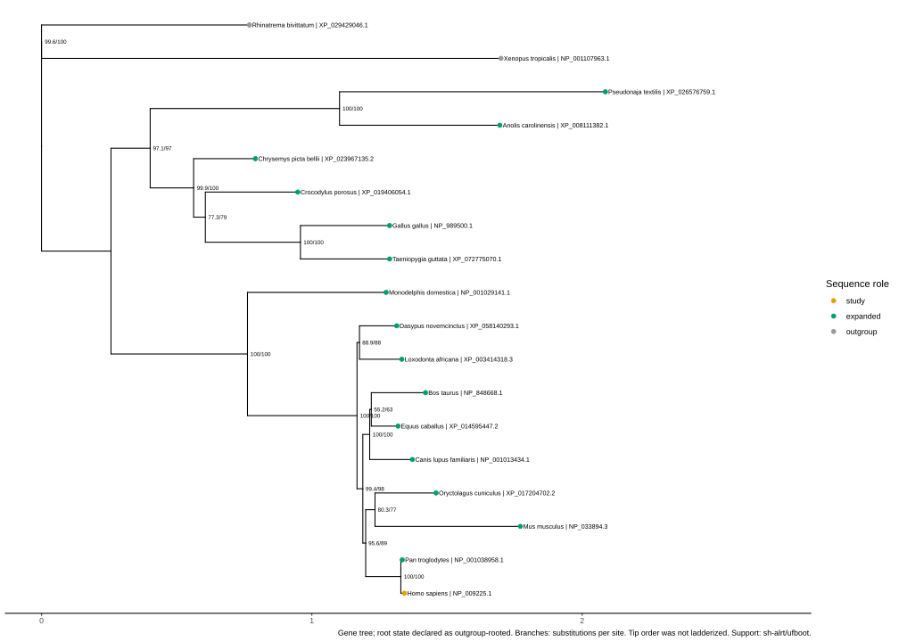

# BRCA1 amniote protein gene tree

This worked example starts from the human RefSeq protein
[`NP_009225.1`](https://www.ncbi.nlm.nih.gov/protein/NP_009225.1) (BRCA1,
GeneID 672), selects a manually fixed set of public ortholog candidates, and
carries them through sequence QC, reference review, alignment, trimming
sensitivity, maximum-likelihood inference, annotation, and literature
comparison.

This is a **single-protein gene tree**, not a species tree. It is useful for
examining the history and annotation consistency of sampled BRCA1 proteins,
but it must not be presented as an independent estimate of amniote species
relationships.

This is deliberately a **fixed-tip demonstration**, not an exhaustive
reference-discovery benchmark. The planner received 18 preselected proteins;
it did not choose those tips from all 3,605 proteins in the downloaded package.
Accordingly, “no rejected records” below applies only to the supplied planner
table and says nothing about unsampled taxa in the provider archive.



Figure 1. IQ-TREE maximum-likelihood BRCA1 protein gene tree rendered with
ggtree/ggplot2. Branch lengths are substitutions per site and internal labels
are SH-aLRT/UFBoot percentages. Orange is the human study sequence, green is an
expanded reference, and gray is an amphibian outgroup. The rooted file is a
separately validated display derivative of the preserved unrooted result.

## Reproducible snapshot

| Item | Frozen value |
| --- | --- |
| Focal protein | Human BRCA1 isoform 1, `NP_009225.1`, 1,863 aa |
| NCBI retrieval | GeneID 672 plus all available NCBI Orthologs, 2026-08-13 |
| Downloaded gene records | 558 |
| Downloaded protein records | 3,605 proteins before metadata and isoform review |
| Analysis tips | 18 total: 16 amniotes (one study tip plus 15 expanded tips) and two amphibian outgroups |
| Taxonomy evidence | Exact `scientific name` + TaxID matches against NCBI `new_taxdump_2026-08-01` |
| Alignment plan | MAFFT E-INS-i; raw alignment plus trimAl `-gt 0.1`, `0.5`, and `0.9` sensitivity profiles |
| Tree plan | Exploratory FastTree profile trees; IQ-TREE ModelFinder, UFBoot2 1,000 + `-bnni`, SH-aLRT 1,000, seed `20260813` |
| Rooting | Conditional derivative only; the unrooted ML tree is the primary preserved result |
| Execution | PBS batch jobs on the gds2 compute environment, with run data staged on Lustre |

The dynamic source archive is not committed. Its acquisition checksums and the
taxdump snapshot receipt are in [PROVENANCE.md](PROVENANCE.md).

The PBS files preserve how this run was staged on one site. Queue `SMALL`,
module names, the module-init path, Lustre staging, and GNU `sha256sum` are
gds2-specific and must be adapted for another scheduler or cluster. Treat the
scripts as execution receipts and site templates, not universally portable
launchers. Raw scheduler output belongs in ignored `pbs-logs/`, never in the
public artifact bundle.

> **Executed-command deviation:** the prospectively approved plan fixed the
> reference set and scientific policy, but the exact host-side argv did not
> conform to that plan. MAFFT and trimAl used relocated, hash-bound paths;
> trimAl also added the output-format-only `-fasta` flag. Final inference used
> IQ-TREE 2.4.0 (`iqtree2`) and prefix `brca1-balanced`, rather than the
> planned prefix `gene-tree`. The explicit model-search, UFBoot2, SH-aLRT,
> thread, and seed settings were unchanged, but scientific equivalence is not
> asserted for non-identical argv.
> [`report/execution_reconciliation.json`](report/execution_reconciliation.json)
> records this post-hoc reconciliation; it does not retroactively authorize the
> launch. A preceding IQ-TREE 3.1.3 (`iqtree3`) attempt was canceled after the
> loaded module ran single-threaded; none of its output was promoted.

## Result summary

The values below are inserted only from completed, checksum-linked artifacts.
The source comments intentionally remain obvious until each result exists.

Within its manually supplied 18-protein table, the final offline review bundle
selected all 18 with no rejected records or blockers: run
`gtr-51d4906dff86327a`, plan hash
`8b03bd3fae2882a07351fc83f1b8879ee616ed61f60570d029c5ef8471f65da8`.
This zero-reject result is not an audit of the full provider archive. MMseqs2
was not triggered because the fixed materialized set contained 18 total tips
(15 expanded tips), not 200 sequences.

All 18 organism names matched the dated NCBI taxdump exactly, and all 18
proteins passed the executable terminal-architecture gate: an N-terminal
RING-related interval plus two distinct C-terminal BRCT intervals. BLAST
union coverage ranged from 0.113 to 1.000 for the human query and from 0.114
to 1.000 for each target. The low full-length values occur in distant BRCA1
central regions; sequences were retained only when NCBI orthology and both
terminal domain systems agreed. Those checks support protein identity but do
not establish positional homology throughout the variable center. No
conserved-block, low-complexity-masked, or terminal-domain-only sensitivity
tree was run, so deep relationships in the full-length tree remain
provisional.

| Alignment | Columns | Retained from raw | Mean occupancy | Parsimony-informative columns |
| --- | ---: | ---: | ---: | ---: |
| raw E-INS-i | 2,179 | 100.00% | 83.09% | 1,464 |
| permissive, `-gt 0.1` | 2,046 | 93.90% | 88.13% | 1,464 |
| balanced, `-gt 0.5` | 1,851 | 84.95% | 94.45% | 1,418 |
| strict, `-gt 0.9` | 1,477 | 67.78% | 98.34% | 1,122 |

Every InterProScan-derived RING/BRCT interval retained at least 80% of its
residues in every trim profile; the observed minimum was 93.68%. This
projection audit completed after the already hash-bound IQ-TREE job had been
submitted, so it is reported as an additional validation of the unchanged MSA,
not as a launch gate for this run. Future executions should require its receipt
before tree submission.

The balanced profile was approved as the primary alignment before inference.
Its SHA-256 is
`b3ea66343c7b4ad4129459715d5de7fdf2f053d9d1eb8b77a0a5637b5ef84dd6`;
the raw MSA SHA-256 is
`9fd8ffaf87c8400175ddb2f42138e0d63bc7d6598d1d2fc3a44cb8f57c304b10`.

IQ-TREE 2.4.0 selected `Q.bird+F+I+R3` by BIC. The final tree had
log-likelihood −45,445.3350 and total branch length 10.1282 substitutions per
site; the run used 789.735 CPU seconds and 99.242 wall-clock seconds. It
completed 1,000 UFBoot2 replicates with `-bnni` and 1,000 SH-aLRT replicates.
IQ-TREE 2.4.0 emitted neither a final bootstrap-correlation coefficient nor a
non-convergence warning, so this record reports completion but does not claim a
numerical UFBoot convergence criterion. One sequence, snake
`XP_026576759.1`, failed the amino-acid composition chi-square test (1/18;
*p* < 0.05, df = 19). Across model testing and the subsequent UFBoot/tree
search, the log repeated the same state-frequency-normalization warning 1,025
times; it contained no `ERROR` line. The composition result is a model-adequacy
caution, while the repeated numerical warning is reported neutrally; neither
is grounds to silently remove a tip after inference.

In the same-method FastTree trimming screen, balanced and strict produced the
same unrooted topology. Raw and permissive each differed from balanced by one
split (Robinson–Foulds distance 2 of a maximum 30; normalized RF 0.066667).
The two amphibian tips formed an isolating outgroup split in all four profiles.
These approximate trees establish trimming sensitivity; they do not replace
the final IQ-TREE likelihood and support analysis.

The final IQ-TREE topology and all four FastTree trim profiles contained the
predeclared two-amphibian isolating split, so the rooting receipt approved a
separate outgroup-rooted derivative. The primary preserved unrooted tree has
SHA-256 `5df0dd2067f52c008637d81d944fc532ef2e3b67fa242b5eb40ec74b7d494380`;
the rooted derivative has SHA-256
`8738dfc3e1a18a4d58a200042d644d7557b6806e8be75d2058b805de2f5d5202`.
Each FastTree profile differed from the final IQ-TREE topology by RF 8/30,
showing that the final likelihood method—not trimming alone—changed four
unrooted splits. The root gate tests topology only: no explicit long-branch,
outgroup-removal, alternative-outgroup, or richer-model root sensitivity was
run.

The prespecified Amphibia (99.6/100), Mammalia (100/100), Sauropsida
(97.1/97), Primates (100/100), Aves (100/100), Lepidosauria (100/100), and
Archelosauria (99.9/100) clades were recovered with SH-aLRT/UFBoot values.
Glires was recovered with weaker UFBoot support (80.3/77), and Archosauria was
weak under both measures (77.3/79). The explicit Crocodylia+Testudines
alternative was not recovered. These single-gene relationships must not be
substituted for a species tree. In particular, the snake composition failure,
the crocodile's 11.3% interval-union BLAST coverage, and the absence of a
conserved-block or terminal-domain-only tree leave deep full-length topology
provisional even where branch support is high.

## Why BRCA1 needs extra alignment care

BRCA1 is not a uniformly conserved globular protein. The focal human protein
has an N-terminal RING region, a long and structurally heterogeneous central
region, and tandem C-terminal BRCT domains. The terminal domains provide
important homology and model-completeness checks, while the variable central
region can accumulate indels, low-complexity sequence, lineage-specific
change, and annotation differences.

For that reason, a long sequence alone was not accepted as a complete BRCA1
ortholog. The executable QC stage combines full-length similarity evidence
with Pfam/SMART evidence for an N-terminal RING-related signature and two
distinct C-terminal BRCT-related intervals. MAFFT E-INS-i is used because it
is appropriate for sequences with conserved blocks separated by long
insertions. Conclusions that change across the raw, permissive, balanced, and
strict alignments are reported as alignment-sensitive rather than resolved.

## Fixed reference set

The sampling is deliberately small enough to audit tip by tip. It spans major
amniote lineages while limiting the analysis to one retained protein model per
species. The two amphibians are proposed outgroups, not guaranteed roots.

| Role | Species | TaxID | RefSeq protein | aa | Sampling label |
| --- | --- | ---: | --- | ---: | --- |
| study | *Homo sapiens* | 9606 | `NP_009225.1` | 1,863 | Primates |
| expanded | *Pan troglodytes* | 9598 | `NP_001038958.1` | 1,863 | Primates |
| expanded | *Mus musculus* | 10090 | `NP_033894.3` | 1,812 | Glires |
| expanded | *Oryctolagus cuniculus* | 9986 | `XP_017204702.2` | 1,853 | Glires |
| expanded | *Canis lupus familiaris* | 9615 | `NP_001013434.1` | 1,878 | Laurasiatheria |
| expanded | *Bos taurus* | 9913 | `NP_848668.1` | 1,849 | Laurasiatheria |
| expanded | *Equus caballus* | 9796 | `XP_014595447.2` | 1,856 | Laurasiatheria |
| expanded | *Loxodonta africana* | 9785 | `XP_003414318.3` | 1,858 | Afrotheria |
| expanded | *Dasypus novemcinctus* | 9361 | `XP_058140293.1` | 1,839 | Xenarthra |
| expanded | *Monodelphis domestica* | 13616 | `NP_001029141.1` | 1,840 | Marsupialia |
| expanded | *Gallus gallus* | 9031 | `NP_989500.1` | 1,749 | Aves |
| expanded | *Taeniopygia guttata* | 59729 | `XP_072775070.1` | 1,803 | Aves |
| expanded | *Crocodylus porosus* | 8502 | `XP_019406054.1` | 1,845 | Crocodylia |
| expanded | *Chrysemys picta bellii* | 8478 | `XP_023967135.2` | 1,908 | Testudines |
| expanded | *Anolis carolinensis* | 28377 | `XP_008111382.1` | 1,697 | Lepidosauria |
| expanded | *Pseudonaja textilis* | 8673 | `XP_026576759.1` | 1,563 | Lepidosauria |
| outgroup | *Xenopus tropicalis* | 8364 | `NP_001107963.1` | 1,592 | Anura |
| outgroup | *Rhinatrema bivittatum* | 194408 | `XP_029429046.1` | 1,920 | Gymnophiona |

The exact sequence hashes, annotation releases, and selection notes are in
[`inputs/candidate_provenance.tsv`](inputs/candidate_provenance.tsv). The
published FASTA and metadata table are
[`inputs/candidates.faa`](inputs/candidates.faa) and
[`inputs/candidates.tsv`](inputs/candidates.tsv).

### What was not treated as an analysis candidate

- The frozen package was inventoried for all 18 selected species plus two
  explicitly screened taxa. The resulting
  [`source_protein_inventory.tsv`](inputs/source_protein_inventory.tsv) records
  518 provider proteins: 18 selected records and 500 not selected. This is a
  scope-limited species inventory, not the complete 3,605-protein acquisition
  universe; taxa outside the targeted list were not enumerated.
- The 498 alternatives from selected species were not promoted beyond the
  fixed one-per-species set and were not individually subjected to downstream
  BLAST, domain, or tree QC; the inventory does not mislabel them as failures.
- One representative was retained per sampled species. An `NP_` prefix was
  treated as RefSeq curation evidence, not as proof that a sequence is the
  canonical biological isoform.
- Two 1,346-aa platypus records (`XP_028930515.1` and `XP_028930516.1`)
  failed only the configured minimum length ratio (0.722491 < 0.75); no domain
  failure is asserted. No tuatara record occurred in the frozen package, so
  that taxon is recorded as absent rather than as a rejected protein.
- No paralog was intentionally admitted. NCBI Ortholog-group membership was
  used for discovery, but it was not used as a topological constraint.
- MMseqs2 was not run on this fixed materialized set because it contains only
  18 reviewed candidates, below the configured 200-sequence trigger. The
  3,605 proteins in the downloaded archive are source breadth, not the eligible
  post-review candidate pool.

## Executed workflow

Commands in this section are shown from the `examples/brca1` directory. Paths
to downloaded archives and batch workspaces are caller-controlled and are not
part of the public provenance record. This section is an executed audit record,
not a one-command rerun recipe: the committed `review/` helper output is
immutable and the helper refuses to overwrite it, while the provider package
and taxdump must be retrieved into a new workspace and verified against the
recorded hashes. Use new staging and review directories for any rerun.

The normalized command ledger distinguishes replayable repository-relative
argv from provenance-only argv containing explicit path tokens. In particular,
the historical plan compiler record points to `<immutable-review-output>` and
is not a replay command against the committed `review/` directory.

### 1. Acquire public records and freeze provenance

NCBI Datasets CLI 18.6.0 retrieved the current ortholog package:

```bash
datasets download gene gene-id 672 --ortholog all \
  --include protein,rna,gene --filename brca1-orthologs.zip
```

The package contained 558 gene records. The fixed accessions were then
materialized with [`scripts/prepare_brca1_example.py`](scripts/prepare_brca1_example.py),
which checks accession, GeneID, TaxID, organism, length, and sequence identity
against the downloaded metadata before writing FASTA and provenance tables.

```bash
python scripts/prepare_brca1_example.py \
  --protein-fasta "$BRCA1_PACKAGE_DIR/ncbi_dataset/data/protein.faa" \
  --data-report "$BRCA1_PACKAGE_DIR/ncbi_dataset/data/data_report.jsonl" \
  --out inputs
```

### 2. Validate names and TaxIDs against an official taxdump

`names.dmp` and `nodes.dmp` were extracted from the dated NCBI archive
`new_taxdump_2026-08-01.zip`. The planner requires a character-for-character
match to the `scientific name` class and exact agreement with the requested
TaxID. Synonyms, aliases, fuzzy matches, missing nodes, and mismatches fail the
entire taxonomy gate. The archive and component hashes are recorded in
[PROVENANCE.md](PROVENANCE.md); the per-tip evidence belongs in
[`review/taxonomy_resolution.tsv`](review/taxonomy_resolution.tsv).

### 3. Check similarity and terminal architecture

The first PBS job runs BLASTP 2.17.0 and InterProScan 5.72-103.0 (Pfam and
SMART) without modifying the source inputs:

```bash
qsub -v BRCA1_RUN_DIR="$RUN_DIR" scripts/run_brca1_qc.pbs
```

BLAST coverage is calculated from the union of all reported HSP intervals,
not from the best HSP alone. In `candidate_qc.tsv`, `alignment_length` is the
sum of HSP lengths and may count overlapping HSPs more than once;
`percent_identity` is weighted over that HSP sum. Neither value is a global
identity or a unique aligned length. The fail-closed summarizer then writes an
enriched candidate table and an auditable domain report:

```bash
python scripts/summarize_brca1_qc.py \
  --candidate-fasta inputs/candidates.faa \
  --candidate-table inputs/candidates.pre-qc.tsv \
  --blast-tsv qc/blastp-human-vs-candidates.tsv \
  --interpro-tsv qc/interproscan-pfam-smart.tsv \
  --out-dir qc/summary
```

The historical copy utility and copy time used to promote
`qc/summary/candidate_qc.tsv` to `qc/candidate_qc.tsv` and
`qc/summary/candidates.tsv` to `inputs/candidates.tsv` were not retained and
are not invented. The deterministic
[`qc_promotion_receipt.json`](report/qc_promotion_receipt.json) regenerates
both summary files from the recorded inputs and proves that each promoted
destination is byte-identical. It is a post-hoc artifact reconciliation, not a
claim that the original copy operation can be replayed exactly.

Any missing RING evidence or fewer than two distinct C-terminal BRCT intervals
stops the QC summarizer. Its measured coverage values replace provisional
metadata in a new immutable input stage; the planner then applies the declared
coverage thresholds and can reject or block an insufficient reference set.
This broad amniote example uses a 0.10 similarity-coverage floor to reject
isolated single-domain matches; full-length conservation is not assumed across
the long, rapidly evolving central region. The independent NCBI orthology and
terminal-domain gates remain mandatory.

### 4. Compile and approve the deterministic reference plan

The bundled helper validates already-local files and compiles a review bundle:

```bash
python ../../skills/bio-gene-to-reference-tree/scripts/gene_to_tree.py plan \
  --request inputs/request.json \
  --out "$NEW_RUN_DIR/review" \
  --offline \
  --dry-run
```

The helper does **not** download sequences, invoke MAFFT/trimAl/IQ-TREE, submit
PBS jobs, or claim that an analysis ran. Its `planned_commands` are argv arrays
with `executed: false`. In the reusable workflow, host-side execution begins
only after the selected references, taxonomy evidence, outgroup rationale, and
current `plan_hash` are reviewed; any changed sequence, threshold, taxdump,
role, or command invalidates prospective conformance.

For this historical run, reference approval bound the reviewed biological set
and declared scientific settings, but it did **not** prospectively approve the
different exact host argv. Those deviations are preserved in
[`report/execution_reconciliation.json`](report/execution_reconciliation.json)
as a post-hoc publication reconciliation, never as retroactive authorization.

### 5. Align, trim, and screen sensitivity on compute nodes

The second PBS job loads MAFFT 7.526, trimAl 1.5.1, and FastTree 2.2.0. It runs
E-INS-i, produces all three trim profiles, summarizes per-sequence and
per-column QC, and builds WAG+Gamma FastTree trees for sensitivity screening:

```bash
qsub -v BRCA1_RUN_DIR="$RUN_DIR" scripts/run_alignment_screen.pbs
```

Domain coordinates from the pre-alignment Pfam/SMART gate are then projected
onto each trim profile. Ambiguous column provenance or less than 80% retention
of any RING/BRCT interval fails closed:

```bash
python scripts/audit_domain_retention.py \
  --raw-alignment alignment/alignment.raw.faa \
  --trimmed-alignment permissive=alignment/alignment.trimmed.permissive.faa \
  --trimmed-alignment balanced=alignment/alignment.trimmed.balanced.faa \
  --trimmed-alignment strict=alignment/alignment.trimmed.strict.faa \
  --candidate-qc qc/candidate_qc.tsv \
  --minimum-retained-fraction 0.8 \
  --output alignment/qc/domain_retention.tsv
```

FastTree output is exploratory approximate maximum likelihood with SH-like
local support; its support values are not bootstrap percentages. For this run,
the balanced alignment was selected from retained length, occupancy, gap
patterns, the pre-alignment terminal-architecture gate, and major-clade
behavior. The coordinate-projection domain-retention audit completed after
IQ-TREE submission and therefore validates the unchanged, hash-bound MSA
retrospectively; future runs should require that audit before submission.
The committed reusable PBS script now enforces the domain-report hash and its
passing receipt before starting IQ-TREE.

### 6. Infer the final unrooted ML tree

The approved alignment hash is bound to the tree run. The accurate path uses
the IQ-TREE 2.4.0 executable (`iqtree2`) with ModelFinder, 1,000 UFBoot2
replicates, `-bnni`, 1,000 SH-aLRT replicates, eight threads, and seed
`20260813`.

```bash
iqtree2 \
  -s alignment/alignment.trimmed.balanced.faa \
  -m MFP \
  -B 1000 \
  -bnni \
  -alrt 1000 \
  -T 8 \
  -seed 20260813 \
  --prefix brca1-balanced
```

The approved plan also named `iqtree2`, but used output prefix `gene-tree` and
a different input path. The executed input is bound to the identical approved
alignment bytes, and the prefix changes output naming only; nevertheless, the
repository makes no blanket scientific equivalence claim for non-identical
argv. The exact planned and executed arrays, their canonical hashes, unchanged
settings, and both differences are bound in the post-hoc reconciliation
receipt. A prior IQ-TREE 3.1.3 (`iqtree3`) attempt was canceled with exit 271
and zero promoted outputs.

The raw native output directory remains in durable private execution storage.
The public `.iqtree` and `.log` copies preserve scientific content but replace
the exact private alignment path and compute-node name; original/public hashes
and counts are recorded in `tree/iqtree/redactions.tsv`. Newick, consensus, and
bootstrap-tree outputs are byte-preserved when they contain no private residue.
Checkpoints, wrapper checksums, and compressed model internals are omitted but
bound by the safe filename/size/hash manifest in
`tree/iqtree/raw-output-receipt.json`. Support labels are interpreted only
after their emitted order is verified; UFBoot2, SH-aLRT, standard bootstrap,
and FastTree SH-like support are never conflated.

### 7. Decide whether a rooted derivative is defensible

The unrooted IQ-TREE result is always preserved. A rooted derivative is
created only when both approved amphibian tips form the same exclusive split
from all 16 amniote tips in the unrooted tree and that placement is not
contradicted by reasonable alignment/trimming sensitivity checks.

The materialized automatic gate tests that exact isolating split in the final
tree and in four FastTree trim profiles. It does **not** perform an explicit
long-branch diagnostic, outgroup-removal analysis, alternative-outgroup test,
or richer-model rooting sensitivity. Therefore a passing gate permits only a
topology-based rooted display hypothesis; it does not establish that
long-branch attraction has been excluded or that the biological root is
resolved. A failing split check stops at the unrooted result. A passing rooted
Newick remains a separately named derivative and never replaces the unrooted
ML tree.

### 8. Annotate, render, and compare with external evidence

The iTOL role strip uses study orange (`#E69F00`), expanded green (`#009E73`),
and outgroup gray (`#999999`). A range dataset is not generated unless a
topology review establishes a meaningful contiguous group. The local
ggtree/ggplot2 renderer checks exact tree/metadata tip equality and writes SVG,
PDF, and settings TSV outputs without rerooting or network access.

The tree is compared with recent broad-scale mammal, bird, reptile, and
amphibian phylogenomics and with BRCA1-specific evidence. These sources define
comparison expectations only; they are not constraints and cannot turn this
single-locus analysis into a species tree. See
[`evidence/literature_evidence.tsv`](evidence/literature_evidence.tsv) and
[`evidence/references.bib`](evidence/references.bib).

## Reading the trimming sensitivity analysis

- **Raw** retains every MAFFT column and exposes where the long central region
  drives gap-rich alignment.
- **Permissive (`-gt 0.1`)** retains columns occupied by at least roughly 10%
  of tips and therefore keeps many lineage-specific central-region positions.
- **Balanced (`-gt 0.5`)** requires roughly half-tip occupancy and is the
  preregistered primary candidate, not an automatically accepted result.
- **Strict (`-gt 0.9`)** emphasizes near-universal columns, which should enrich
  conserved blocks but can discard informative lineage-specific sequence.

Agreement across profiles raises confidence that major BRCA1 splits are not an
artifact of one gap treatment. A major split that appears only under one
profile, or a root decision that changes across profiles, is reported as
unstable. FastTree screening is not substituted for the final ModelFinder +
UFBoot2/SH-aLRT analysis.

## Artifact map

The public example follows the skill output contract. Raw provider archives
and the full NCBI taxdump are omitted because they are large and dynamic; their
receipts and hashes are retained.

| Stage | Reviewable artifacts |
| --- | --- |
| Inputs | [`request.json`](inputs/request.json), [`query.faa`](inputs/query.faa), [`candidates.faa`](inputs/candidates.faa), [`candidate_provenance.tsv`](inputs/candidate_provenance.tsv), [`source_protein_inventory.tsv`](inputs/source_protein_inventory.tsv) |
| Candidate QC | `qc/candidate_qc.tsv`, `qc/interproscan-pfam-smart.tsv`, `qc/blastp-human-vs-candidates.tsv`, [`report/qc_promotion_receipt.json`](report/qc_promotion_receipt.json) |
| Deterministic plan | `review/selected_references.tsv`, `review/rejected_references.tsv`, `review/reference_set.faa`, `review/sequence_metadata.tsv`, `review/taxonomy_resolution.tsv`, `review/plan.json`, `review/manifest.json` |
| Alignment | `alignment/alignment.raw.faa`, `alignment/alignment.trimmed.<profile>.faa`, `alignment/qc/alignment_qc.tsv`, `alignment/qc/sequence_qc.tsv`, `alignment/qc/domain_retention.tsv` |
| Exploratory trees | `exploratory-tree/{raw,permissive,balanced,strict}.fasttree.nwk` and matching logs |
| Final tree | `tree/gene-tree.unrooted.nwk`, `tree/iqtree/`, `tree/gene-tree.topology_sensitivity.tsv`, and `rooting-decision.tsv`; `tree/gene-tree.outgroup-rooted.nwk` only after every declared root screen passes |
| Annotation | `annotation/itol_roles.txt`, `annotation/sequence_metadata.tsv`, `annotation/taxonomy_resolution.tsv`, [`annotation/taxonomy_lineage.tsv`](annotation/taxonomy_lineage.tsv); no range file unless topology justifies it |
| Figure | `figures/gene-tree.<root-state>.ggtree.svg`, `.pdf`, and `.settings.tsv` |
| Evidence | [`literature_evidence.tsv`](evidence/literature_evidence.tsv), [`references.bib`](evidence/references.bib) |
| Approval receipts | `reference-approval.tsv`, `alignment-approval.tsv`, `domain-retention-approval.tsv` |
| Audit report | `report/report.md`, `report/commands.jsonl`, [`report/execution_reconciliation.json`](report/execution_reconciliation.json), `report/execution_reconciliation.schema.json`, `report/software_versions.tsv`, `report/checksums.sha256` |
| Data/license notice | [`DATA_LICENSES.md`](DATA_LICENSES.md) |

The example metadata intentionally distinguishes verified and analyst-assigned
fields. Species names, TaxIDs, parent TaxIDs, ranks, and full root-to-tip
lineages are derived from the frozen taxdump. The plan-bound
`sequence_metadata.tsv` retains an empty legacy `lineage` column and a manual
sampling `clade`; the separately hash-bound `taxonomy_lineage.tsv` is the
authoritative full-lineage evidence. Do not treat manual clade labels as
taxonomic lineage evidence.

[SVG figure](figures/gene-tree.outgroup-rooted.ggtree.svg) ·
[PDF figure](figures/gene-tree.outgroup-rooted.ggtree.pdf) ·
[unrooted Newick](tree/gene-tree.unrooted.nwk) ·
[rooted derivative](tree/gene-tree.outgroup-rooted.nwk) ·
[clade support](tree/clade_support.tsv) ·
[topology sensitivity](tree/gene-tree.topology_sensitivity.tsv) ·
[sequence metadata](annotation/sequence_metadata.tsv) ·
[taxonomic lineages](annotation/taxonomy_lineage.tsv) ·
[iTOL roles](annotation/itol_roles.txt) ·
[IQ-TREE report](tree/iqtree/brca1-balanced.iqtree) ·
[execution reconciliation](report/execution_reconciliation.json) ·
[checksums](report/checksums.sha256)

## Reuse boundary

This example is a dated, public-data demonstration. Re-running it later may
retrieve different orthologs or annotations. Reuse the workflow and audit
rules, not the biological conclusion, and freeze new database snapshots before
comparing runs.
